Usage
Create diagrams in markdown using mermaid fenced code blocks:

You can also use ::: blocks:

::: mermaid
graph TD;
    A-->B;
    A-->C;
    B-->D;
    C-->D;
:::

Supports MDI and logos icons from Iconify:

```mermaid
architecture-beta
    service user(mdi:account)
    service lambda(logos:aws-lambda)

    user:R --> L:lambda
```

